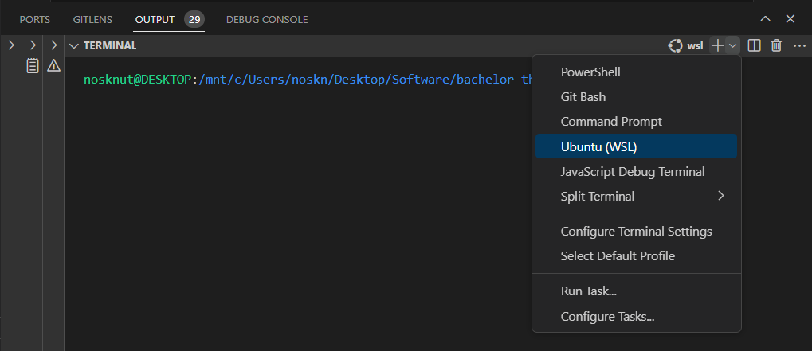

# WSL

The following instructions are for installing and using windows subsystem for linux (WSL), which allows you to run docker desktop and linux GUI applications directly in windows.

## Install WSL

- Follow the instructions in [this](https://youtu.be/AMlaEFaKG88?si=Uk1TH-ulXn2jgdA9) video or [this](https://docs.microsoft.com/en-us/windows/wsl/install-win10) website to install WSL.
- Make sure WSL2 is the default version
```bash
wsl --set-default-version 2
```
- [Install Ubuntu WSL](https://apps.microsoft.com/detail/9PDXGNCFSCZV?hl=en-us&gl=US) from the Microsoft Store.
- Run the setup by launching the Ubuntu app from the start menu
- [Configure WSL GUI Support](https://learn.microsoft.com/en-us/windows/wsl/tutorials/gui-apps) by running the following commands in powershell
```bash
wsl --update
```

## Launch wsl terminal from VSCode



## Create symlink to project in WSL home directory

It is practical to create a shortcut the project folder in the WSL home directory. This way, you can easily access the project folder from any GUI application running in WSL.

```bash
ln -s /mnt/c/Users/username/path/to/<project-name> ~/<project-name>
```